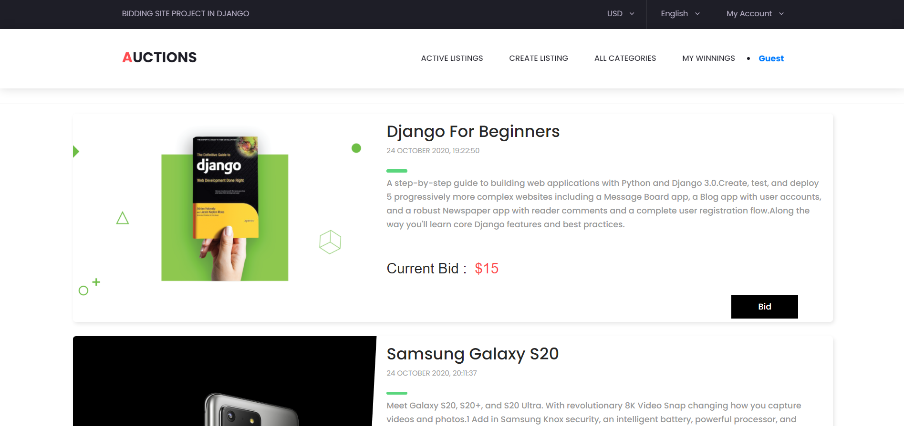

<div id="top"></div>

[![Contributors][contributors-shield]][contributors-url]
[![Forks][forks-shield]][forks-url]
[![Stargazers][stars-shield]][stars-url]
[![Issues][issues-shield]][issues-url]
[![MIT License][license-shield]][license-url]
[![LinkedIn][linkedin-shield]][linkedin-url]


<!-- PROJECT LOGO -->
<br />
<div align="center">
  <a href="https://github.com/sharmas1ddharth/commerce">
    
  </a>

  <h3 align="center">Auctions</h3>

  <p align="center">
    A bidding web-app project built with Django
    <br />
    <br />
    <a href="https://auctions-ap.herokuapp.com">View Demo</a>
    ·
    <a href="https://github.com/othneildrew/Best-README-Template/issues">Report Bug</a>
    ·
    <a href="https://github.com/othneildrew/Best-README-Template/issues">Request Feature</a>
  </p>
</div>


<!-- TABLE OF CONTENTS -->
<details>
  <summary>Table of Contents</summary>
  <ol>
    <li>
      <a href="#about-the-project">About The Project</a>
      <ul>
        <li><a href="#built-with">Built With</a></li>
      </ul>
    </li>
    <li>
      <a href="#getting-started">Getting Started</a>
      <ul>
        <li><a href="#prerequisites">Prerequisites</a></li>
        <li><a href="#installation">Installation</a></li>
      </ul>
    </li>
    <li><a href="#contributing">Contributing</a></li>
    <li><a href="#license">License</a></li>
  </ol>
</details>


<!-- ABOUT THE PROJECT -->
## About The Project




A bidding web-app project where one can bid on the listings, add the listing to the watchlist by creating an account. One can easily login and create his/her own unique watchlist.

<p align="right">(<a href="#top">back to top</a>)</p>


### Built With

* [HTML5]()
* [CSS3]()
* [Python3](https://www.python.org/)
* [Django](https://www.djangoproject.com/)

<p align="right">(<a href="#top">back to top</a>)</p>


<!-- GETTING STARTED -->
## Getting Started

To run this project locally you need to have Python3 installed in your system.

### Prerequisites
* [Python3](https://www.python.org/ftp/python/3.10.0/python-3.10.0-amd64.exe)

* Django
  ```sh
  pip install django
  ```

### Installation

1. Clone the repo
   ```sh
   git clone https://github.com/sharmas1ddharth/commerce
   ```
2. Download and install Python3 and check if Python is installed or not by typing the following in terminal.
    ```
    python --version
    ```
5. Install requirements.txt
   ```sh
   pip install -r requirements.txt
   ```

<p align="right">(<a href="#top">back to top</a>)</p>


<!-- CONTRIBUTING -->
## Contributing

Contributions are what make the open source community such an amazing place to learn, inspire, and create. Any contributions you make are **greatly appreciated**.

If you have a suggestion that would make this better, please fork the repo and create a pull request. You can also simply open an issue with the tag "enhancement".
Don't forget to give the project a star! Thanks again!

1. Fork the Project
2. Create your Feature Branch (`git checkout -b feature/AmazingFeature`)
3. Commit your Changes (`git commit -m 'Add some AmazingFeature'`)
4. Push to the Branch (`git push origin feature/AmazingFeature`)
5. Open a Pull Request

<p align="right">(<a href="#top">back to top</a>)</p>


<!-- LICENSE -->
## License

Distributed under the MIT License. See [`LICENSE`](https://github.com/sharmas1ddharth/commerce/blob/main/LICENSE) for more information.

<p align="right">(<a href="#top">back to top</a>)</p>


<!-- MARKDOWN LINKS & IMAGES -->
<!-- https://www.markdownguide.org/basic-syntax/#reference-style-links -->
[contributors-shield]: https://img.shields.io/github/contributors/sharmas1ddharth/commerce.svg?style=for-the-badge
[contributors-url]: https://github.com/sharmas1ddharth/commerce/graphs/contributors
[forks-shield]: https://img.shields.io/github/forks/sharmas1ddharth/commerce.svg?style=for-the-badge
[forks-url]: https://github.com/sharmas1ddharth/commerce/network/members
[stars-shield]: https://img.shields.io/github/stars/sharmas1ddharth/commerce.svg?style=for-the-badge
[stars-url]: https://github.com/sharmas1ddharth/commercee/stargazers
[issues-shield]: https://img.shields.io/github/issues/sharmas1ddharth/commerce.svg?style=for-the-badge
[issues-url]: https://github.com/sharmas1ddharth/commerce/issues
[license-shield]: https://img.shields.io/github/license/sharmas1ddharth/commerce.svg?style=for-the-badge
[license-url]: https://github.com/sharmas1ddharth/commerce/blob/master/LICENSE.txt
[linkedin-shield]: https://img.shields.io/badge/-LinkedIn-black.svg?style=for-the-badge&logo=linkedin&colorB=555
[linkedin-url]: https://www.linkedin.com/in/sharmas1ddharth/
[product-screenshot]: https://github.com/sharmas1ddharth/commerce/blob/main/Images/screenshot.png

